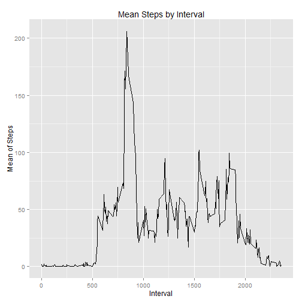

## Loading and preprocessing the data

* Set's working directory
* Reads in activity data
* Converts dates to POSIXlt class
* Breaks down steps and intervals into columns
* Creates new data set


```r
setwd("C:/Users/ghobbs/Desktop")
active <- read.csv("activity.csv")
days <- strptime(as.character(active[,2]), "%Y-%m-%d")
weekday <- weekdays(days)
steps <- active[,1]
interval <- active[,3]
data1 <- data.frame(days,weekday,steps,interval)
names(data1) <- c("days","weekday","steps","interval")
```

## What is mean total number of steps taken per day?

* Requires packages 'ggplot2' for data analysis and plotting
* Aggregates steps by day
* Plots data and presents histogram
* Calculates the Mean and Median Steps taken per day


```r
require('ggplot2')
stepday <- aggregate(data1$steps~days, data=data1, FUN=sum)
gsteps <- ggplot(stepday, aes(x=stepday[,2]))
gsteps+geom_histogram(colour='blue',fill='orange',binwidth=500)+xlim(c(0,25000))+ylim(c(0,25))+ xlab("Number of Steps per Day")+ylab("Number of Days")+ggtitle("Steps [No NAs]")
```

 

```r
mean1 <- mean(stepday[,2])
median1 <- median(stepday[,2])
```

```r
print(mean1)
```

```
## [1] 10766.19
```

```r
print(median1)
```

```
## [1] 10765
```
The mean and median of the data set are seen above in the print function.  Mean1 is the mean and Median1 is the median.

## What is the average daily activity pattern?


* Aggregates steps by interval and finds mean
* Creates a time series plot; aggregate steps by interval by mean
* Presents data to dechipher maximum number of steps


```r
stepint <- aggregate(data1$steps~interval, data=data1, FUN=mean)
names(stepint) <- c("interval", "steps")
gstep <- ggplot(stepint, aes(x=stepint$interval, y=stepint$steps), group=1)
gstep+geom_line()+xlab("Interval")+ylab("Mean of Steps")+ggtitle("Mean Steps by Interval")
```

 

```r
maxstep <- max(stepint$steps)
maxstepint <- stepint$interval[which.max(stepint$steps)]
print(maxstepint)
```

```
## [1] 835
```
The 5-minute interval that contains the maximum number of steps is in calculation seen above


## Imputing missing values

* Calculates and reports the total number of missing values in the dataset
* Strategy for filling in all of the missing values in the dataset is to clean the data set and provide a new dataset using the mean of the steps taken per interval in the clean data set
* Creates a new dataset that is equal to the original dataset but with the missing data filled in.
* Makes a histogram of the total number of steps taken each day and calculates and report the mean and median total number of steps taken per day. 


```r
issue <- is.na(steps)
sumissue <- sum(issue)
data2 <- data1
for (i in 1:17568){
    if(is.na(data1[i,3])==TRUE){
        data2[i,3] <- mean(data1[data1$interval==data1[i,'interval'],]$steps, na.rm=TRUE )
    }
}
gNewStep <- ggplot(data2, aes(x=data2[,3]))
gNewStep+geom_histogram(fill='orange',binwidth=1)+xlim(c(0,900))+ylim(c(0,30))+ xlab("Number of Steps per Day")+ylab("Number of Days")+ggtitle("Number of Steps per Day [Replaced NA]")
```

 

```r
meanNew <- mean(data2[,3])
medianew <- median(data2[,3])
```
The values in the new data set differ from the estimates from the first part of the assignment; the data set with the NA's.  The impact is that the mean and medians are less than they were before.

## Are there differences in activity patterns between weekdays and weekends?

* Requires lattice package
* Weekday and weekend dates are designated
* Takes mean of both designation noted above
* Plots data in a panel plot replicating what is in the rdpeng readme file example


```r
require('lattice')
data2$wkday <- ifelse(weekdays(data2$days)=="Saturday"|weekdays(data2$days)=="Sunday", data2$wkday <- "Weekend", data2$wkday <- "Weekdays")
stepDay <- aggregate(steps~interval+wkday, data=data2, FUN=mean)
xyplot(steps~interval|wkday, data=stepDay, type="l", layout=c(1,2), xlab="Interval [Int]", ylab="Average Steps", main="Average Steps per Int")
```

 

There are differences in the activity patterns between the week day and weekend.  From the plots you can so that while there is a higher average steps taken in one given interval, the average number of steps taken, over all intervals, is higher on the weekends than on the weekdays.
